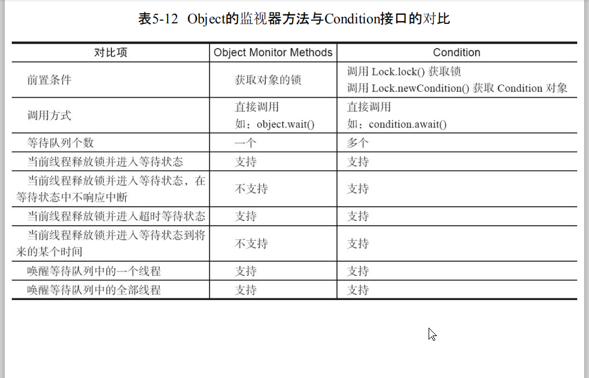
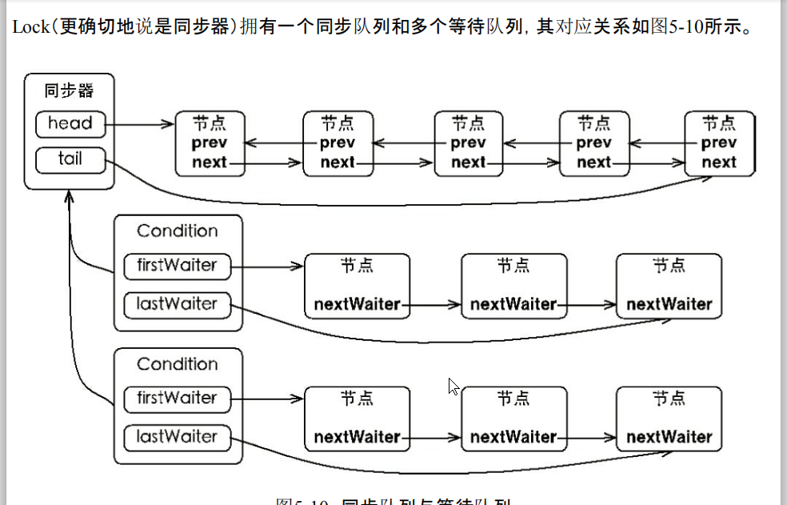
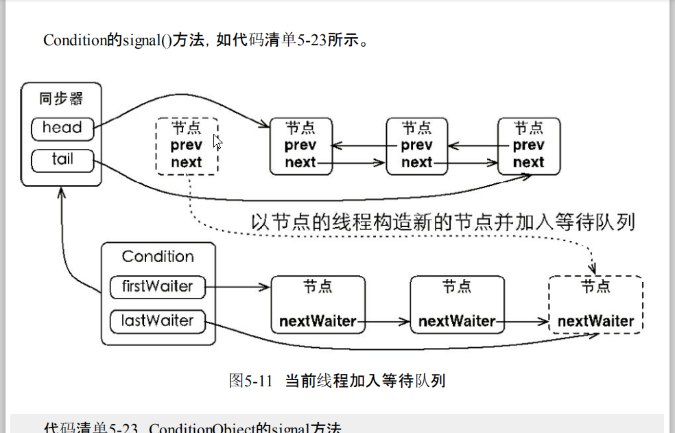
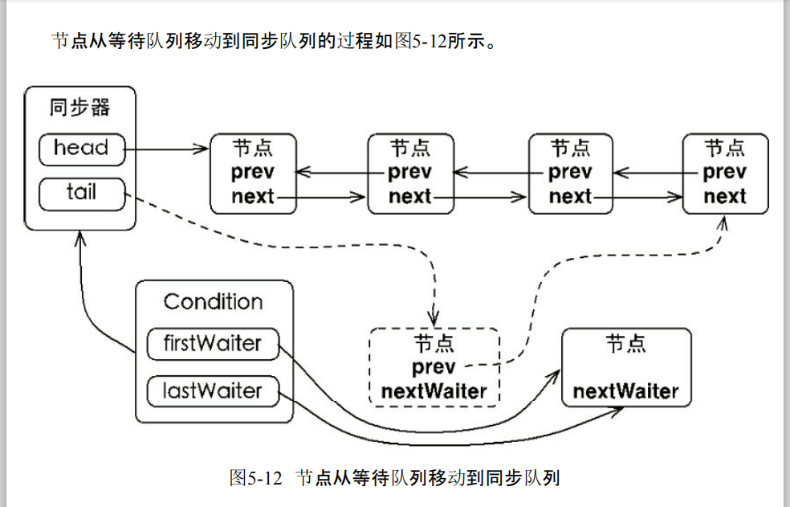

# RentrantReadWriteLock
## 核心
> **读状态取state的高16位，写状态取state的低16位，来解决一个state需要标识read和write的状态。**
> 写Lock  排他、独占式的
> 读Lock  共享式的

### 示例
```java
/**
 * describe:
 * E-mail:yzzstyle@163.com  date:2018/12/16
 *
 * @Since 0.0.1
 */
public class ReentrantReadWriteLockTest {

    static ReentrantReadWriteLock reentrantReadWriteLock = new ReentrantReadWriteLock();
    static Lock readLock = reentrantReadWriteLock.readLock();
    static Lock writeLock = reentrantReadWriteLock.writeLock();

    static class R extends Thread {
        @Override
        public void run() {
            readLock.lock();
            System.out.println("读"+Thread.currentThread().getName());
            readLock.unlock();
        }
    }

    static class W extends Thread {
        @Override
        public void run() {
            writeLock.lock();
            System.out.println("写"+Thread.currentThread().getName());
            writeLock.unlock();
        }
    }

    public static void main(String[] args) {
        for (int i = 0; i < 10; i++) {
            if (i%2 == 0){
                Thread r = new R();
                r.start();
            }else {
                Thread w = new W();
                w.start();
            }
        }
    }
}
```
### 降级锁(同一线程，数据的更改是可见的)
>含义就是在写lock的时候，可以允许去获取读锁，此时没有做降级的时候，读锁是“阻塞”的，但是做了降级后，读锁可以被获取到，
 读锁释放，那么该线程就从写锁线程变成了读锁线程了。

```
    public void processData() {
        readLock.lock();
        if (!update) {
            // 必须先释放读锁
            readLock.unlock();
            // 锁降级从写锁获取到开始
            writeLock.lock();
            try {
                if (!update) {
                // 准备数据的流程（略）
                update = true;
            }
                readLock.lock();
            } finally {
                 writeLock.unlock();
            }
             // 锁降级完成，写锁降级为读锁
        }
        try {
            // 使用数据的流程（略）
         } finally {
             readLock.unlock();
         }
    }
```
### LockSupport类
* 调用Unsafe的park(停车)方法
>LockSupport定义了一组以park开头的方法用来阻塞当前线程，以及unpark(Thread thread)
 方法来唤醒一个被阻塞的线程
>相当于wait和notify

### Condition

> Condition 操作的前提是，当前线程是同步队列中的head，获取到了锁，才能进行等待/唤醒操作
* Condition 维护了一个Node等待队列



* await操作
> 会将该线程从Syn队列中移动到Condition等待队列的队尾


* single操作
> 会将该线程从Condition中移动到Syn的同步队列的队尾


#### Condition示例
> 此例中实现了伪消费者，是排他锁的实现
> 当数组长度满的时候，remove将被唤醒，清空数组
> 当数组容量小于长度时，remove将阻塞，add方法被唤醒

##### 注意
* 这里要注意唤醒后的执行顺序，是逻辑顺序往下执行，所以必须要double check，此处唤醒是唤醒了所有等待的线程，有可能出现生产者唤醒生产者的情况

* 疑问
  add()方法已经lock到锁了，为什么await后，remove可以获取锁，在add没有unlock之前是无法获取锁的？？？
  
 > 原因：
 
 
 > await()-->fullyRelease()-->release()-->tryRelease
 >release方法如下
 ```
 public final boolean release(long arg) {
        if (tryRelease(arg)) {
            Node h = head;
            if (h != null && h.waitStatus != 0)
                unparkSuccessor(h);
            return true;
        }
        return false;
    }
```
>在single的时候，或有enqueue操作，我们的lock方法在无法获取锁的情况下就会enqueue操作，进入同步队列
>so it's ok...

```java
/**
 * describe:
 * E-mail:yzzstyle@163.com  date:2018/12/16
 *
 * @Since 0.0.1
 */
public class ConditionWaitAndNotify {
    //排它锁
    private Lock lock = new ReentrantLock();
    private Condition condition = lock.newCondition();

    private Object[] ts;

    private int index;

    public ConditionWaitAndNotify(int count) {
        if (count <= 0) throw new IllegalArgumentException("count must not be null");
        ts = new Object[count];
    }

    public void add() {
        try {
            lock.lock();
            //one check
            if (index == ts.length) {
                condition.await();
            }
            //double check
            if (index == ts.length) {
                return;
            }
            ts[index] = new Object();
            index++;
            System.out.println("add" + index);
            condition.signalAll();
        } catch (Exception e) {
            e.printStackTrace();
        } finally {
            lock.unlock();
        }
    }

    public void remove() {
        try {
            lock.lock();
            //one check
            if (index < ts.length) {
                condition.await();
            }
            //double check
            if (index < ts.length){
                return;
            }
            index = 0;
            System.out.println("remove" + index);
            condition.signalAll();
        } catch (Exception e) {
            e.printStackTrace();
        } finally {
            lock.unlock();
        }
    }

    static Thread createAdd(ConditionWaitAndNotify conditionWaitAndNotify){
        return new Thread(() -> {
            while (true){
                conditionWaitAndNotify.add();
                try {
                    //Thread.sleep(1000);
                } catch (Exception e) {
                    e.printStackTrace();
                }
            }
        });
    }
    static Thread createRemove(ConditionWaitAndNotify conditionWaitAndNotify){
        return new Thread(() -> {
            while (true) {
                conditionWaitAndNotify.remove();
                try {
                    //Thread.sleep(1000);
                } catch (Exception e) {
                    e.printStackTrace();
                }
            }
        });
    }


    public static void main(String[] args) {
        ConditionWaitAndNotify conditionWaitAndNotify = new ConditionWaitAndNotify(3);
        Thread t1 = createAdd(conditionWaitAndNotify);
        Thread t11 = createAdd(conditionWaitAndNotify);
        Thread t2 = createRemove(conditionWaitAndNotify);
        Thread t22 = createRemove(conditionWaitAndNotify);
        t1.start();
        t11.start();
        t2.start();
        t22.start();
    }
}

```
