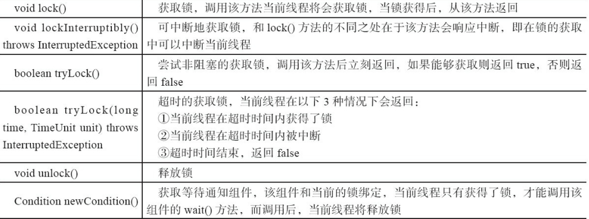

[TOC]
## Lock
### 方法
1. void lock();
    >获取锁,当该锁没有获取到，当前线程不能被线程调度，处于休眠状态
2. void lockInterruptibly() throws InterruptedException;
    >当前线程没有interrupted的前提下获取锁，会有InterruptedException异常
3. boolean tryLock()
    >尝试去获取锁，如果得到锁返回true，否则返回false,也就是说，它是通过返回值来确定是否获取该锁。//无阻塞
    ```
       * Lock lock = ...;
            * if (lock.tryLock()) {
            *   try {
            *     // manipulate protected state
            *   } finally {
            *     lock.unlock();
            *   }
            * } else {
            *   // perform alternative actions
            * }}</pre>
    ```
4. boolean tryLock(long time, TimeUnit unit) 
   >同上，加上了一个等待时间。
5. Condition newCondition()
   > 与该锁绑定的一个多线程通信的一个类
   
   
   ```
      //官方的实例
      class BoundedBuffer {
        final Lock lock = new ReentrantLock();
        final Condition notFull  = <b>lock.newCondition(); 
        final Condition notEmpty = <b>lock.newCondition(); 
     
        final Object[] items = new Object[100];
        int putptr, takeptr, count;
     
        public void put(Object x) throws InterruptedException {
          //先获取锁(like synchrozied)
          <b>lock.lock();
          try {
          //相当标准 先判断wait
            while (count == items.length)
              <b>notFull.await();
           //执行操作且改变状态
            items[putptr] = x;
            if (++putptr == items.length) putptr = 0;
            ++count;
            //从等待队列中唤醒一个线程进入lock队列，去竞争锁
            <b>notEmpty.signal();
          <b>} finally {
            lock.unlock();
          }
        }
        //同上
        public Object take() throws InterruptedException {
          <b>lock.lock();
          try {
            while (count == 0)
              <b>notEmpty.await();
            Object x = items[takeptr];
            if (++takeptr == items.length) takeptr = 0;
            --count;
            <b>notFull.signal();
            return x;
          <b>} finally {
            lock.unlock();
          }
        }
      }
    ```     
### 与synchronized的区别


