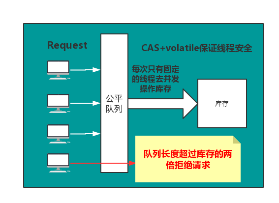

# 模拟秒杀
## 思路

* 对每个秒杀请求入队操作
* 当库存为N时，队列的长度超过N时，可以考虑拒绝后续请求，直接响应客户端秒杀结束
* 为了减轻库存处理的压力，验证并发量，这里通过信号量来控制线程安全。
## 编码
### 通过Semaphore来控制并发量
### 通过CAS来控制更新库存，保证线程安全
```java
/***
 * 模拟秒杀
 */
public class Knock {

    /**
     * CAS操作的类
      */
    private static final Unsafe unsafe;
    /**
     * total的偏移量
     */
    private static final long totalOffset;

    /**
     * 单实例
     */
    private static volatile Knock knock;

    /**
     * 总数量
     */
    private volatile int total;

    /**
     * 信号量
     */
    private Semaphore semaphore;

    /**
     * 初始化UnSafe
     * 只能通过反射实例化
     * 在catch出只能抛出Error，unsafe只能初始化一次
     */
    static {
        try {
            Field field = Unsafe.class.getDeclaredField("theUnsafe");
            field.setAccessible(true);
            unsafe = (Unsafe) field.get(null);
            totalOffset = unsafe.objectFieldOffset(Knock.class.getDeclaredField("total"));
        } catch (Exception e) {
            e.printStackTrace();
            throw new Error(e);
        }

    }

    /**
     * 初始化公平的信号量
     *
     * @param total          总数
     * @param threadsPerTime 线程所需要的信号,控制并发量
     */
    private Knock(int total, int threadsPerTime) {
        this.total = total;
        semaphore = new Semaphore(threadsPerTime, true);
    }

    /**
     * 单例 lazy
     *
     * @param total
     * @param threadsPerTime
     * @return
     */
    public static Knock getInstance(int total, int threadsPerTime) {
        //one check
        if (null != knock) {
            return knock;
        }
        //double check
        synchronized (Knock.class) {
            if (null == knock) {
                //knock需要加上volatile关键字，1.禁止重排序 2.线程间可见
                knock = new Knock(total, threadsPerTime);
            }
        }
        return knock;
    }

    public int getTotal() {
        return total;
    }

    /**
     * CAS 减法
     * 死循环退出的条件
     * 1. 总数大于0的情况下，去做一次CAS操作，操作成功，则返回，失败则循环
     * 2. 如果total==0的情况下，直接返回false，终止抢购
     * @return
     */
    public boolean casTotal(int except) {
        for (; ; ) {
            if (total > 0) {
                int update = total - 1;
                if (unsafe.compareAndSwapInt(this, totalOffset, except, update)) {
                    return true;
                }
            } else {
                return false;
            }

        }
    }

    /**
     * 抢购
     *
     * @param need
     */
    public void doKnock(int need) {
        //当队列的长度时商品总量的两倍就返回，抢购失败
        //当total==0的时候，抢购失败
        if (semaphore.getQueueLength() > (total << 1) || total == 0) {
            System.out.println(Thread.currentThread().getId() + "：已售罄！");
            return;
        }
        //抢购
        try {
            //获取资源
            semaphore.acquire(need);
            //这里要check total的值，不符合就直接返回
            if (total == 0) {
                System.out.println(Thread.currentThread().getId() + "已售罄！");
                return;
            }
            //这里必须通过局部变量接收，因为信号量模式，同一时间有多个线程在同时执行，是线程不安全的
            int expect = total;
            //CAS修改当前库存
            if (casTotal(expect)) {
                //current是当前线程消费过后的库存
                int current = expect - 1;
                System.out.println(Thread.currentThread().getId() + "当前剩余:" + current);
            }
        } catch (Exception e) {
            e.printStackTrace();
        } finally {
            //释放资源
            semaphore.release(need);
        }
    }
}
```
## 测试，通过CPU核心数，去控制并发的线程，提高QPS
```java
public class KTest {

    static class T extends Thread {
        private Knock knock;
        private int need;

        public T(Knock knock, int need) {
            this.knock = knock;
            this.need = need;
        }

        @Override
        public void run() {
            knock.doKnock(need);
        }
    }

    public static void main(String[] args) {
        //获取可用CPU核心数
        int availableProcessors = Runtime.getRuntime().availableProcessors();
        long s = System.currentTimeMillis();
        Knock knock = Knock.getInstance(1100, availableProcessors*2);
        for (int i = 0; i < 2000; i++) {
            T t = new T(knock, 1);
            try {
                t.start();
                t.join();
            } catch (InterruptedException e) {
                e.printStackTrace();
            }
        }
        long e = System.currentTimeMillis();
        System.out.println(knock.getTotal() + "======================"+(e-s));
    }
}
```