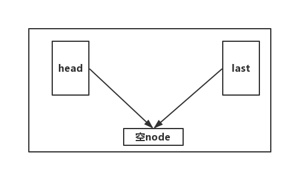
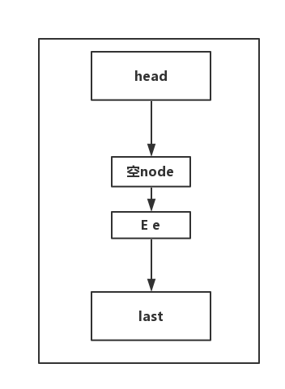
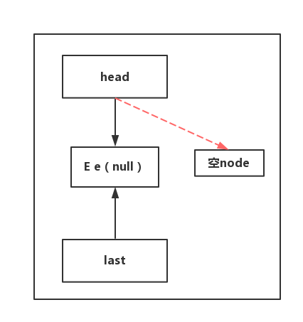

#java并发-阻塞队列(BlockingQueue)
## 何为阻塞队列
>A {@link java.util.Queue} that additionally supports operations
 that wait for the queue to become non-empty when retrieving an
 element, and wait for space to become available in the queue when
 storing an element.\
 
 **即：**
 * 在添加元素的时候，在队列满的时候会处于等待状态，知道队列有空加才去添加
 * 在移除元素的时候，当队列为空即队列长队为0的时候，将等待知道队列不为空才可移除队列node
 
## 何处用到了阻塞队列？
* 线程池，ThreadPoolExecutor使用的是BlockingQueue 

## 实现类
* ArrayBlockingQueue：一个由数组结构组成的有界阻塞队列。
* LinkedBlockingQueue：一个由链表结构组成的有界阻塞队列。
* PriorityBlockingQueue：一个支持优先级排序的无界阻塞队列。
* DelayQueue：一个使用优先级队列实现的无界阻塞队列。
* SynchronousQueue：一个不存储元素的阻塞队列
* LinkedTransferQueue 个由链表结构组成的无界阻塞队列
* LinkedBlockingQueue 一个由链表结构组成的双向阻塞队列
## 详解LinkedBlockingQueue(tomcat线程池用的是LinkedBlockingQueue)
### 入队出队流程
>init
 
```
     public LinkedBlockingQueue(int capacity) {
            if (capacity <= 0) throw new IllegalArgumentException();
            //queue的最大容量
            this.capacity = capacity;
            //last和head指向同一个引用
            last = head = new Node<E>(null);
        }
``` 
> enqueue
 
 * 第一次入队，那么last和head就分道扬镳了
 * 每一次入队，last都指向最后一个node
 ```java
    private void enqueue(Node<E> node) {
        // assert putLock.isHeldByCurrentThread();
        // assert last.next == null;
        last = last.next = node;
    }
```
> dequeue
* 每一次出队操作，head.next的引用就指向队列的下一个，head.item永远都为空，head.next才是正真的队首

```java
    private E dequeue() {
        // assert takeLock.isHeldByCurrentThread();
        // assert head.item == null;
        Node<E> h = head;
        Node<E> first = h.next;
        h.next = h; // help GC
        head = first;
        E x = first.item;
        first.item = null;
        return x;
    }
```
### 线程安全
**采用的是AQS的ReentrantLock来实现**
* ReentrantLock(putLock)
  * notFull(Codition)
```java
 public void put(E e) throws InterruptedException {
         if (e == null) throw new NullPointerException();
         // Note: convention in all put/take/etc is to preset local var
         // holding count negative to indicate failure unless set.
         //局部变量保证 可重复读，与外界隔离，有点事务的隔离性
         int c = -1;
         Node<E> node = new Node<E>(e);
         final ReentrantLock putLock = this.putLock;
         final AtomicInteger count = this.count;
         putLock.lockInterruptibly();
         try {
             /*
              * Note that count is used in wait guard even though it is
              * not protected by lock. This works because count can
              * only decrease at this point (all other puts are shut
              * out by lock), and we (or some other waiting put) are
              * signalled if it ever changes from capacity. Similarly
              * for all other uses of count in other wait guards.
              */
             while (count.get() == capacity) {
                 notFull.await();
             }
             //入队操作
             enqueue(node);
             c = count.getAndIncrement();
             //这里必须要通知其他put线程
             if (c + 1 < capacity)
                 notFull.signal();
         } finally {
             putLock.unlock();
         }
         //不懂
         if (c == 0)
             signalNotEmpty();
     }
```
* ReentrantLock(takeLock)
  * notEmpty(Codition)
````java
//同上
public E take() throws InterruptedException {
        E x;
        int c = -1;
        final AtomicInteger count = this.count;
        final ReentrantLock takeLock = this.takeLock;
        takeLock.lockInterruptibly();
        try {
            while (count.get() == 0) {
                notEmpty.await();
            }
            x = dequeue();
            c = count.getAndDecrement();
            if (c > 1)
                notEmpty.signal();
        } finally {
            takeLock.unlock();
        }
        //不懂
        if (c == capacity)
            signalNotFull();
        return x;
    }
````
> 入队和出队采用不同的锁，通过AtomicInteger来保证队列技术器的线程安全。不同操作使用不同的锁，效率很高。通过Codition来进行线程间
  通讯，及时唤醒。这里采用了两把锁，相比一把锁更加高效，take和put操作互不影响。
## **疑问** 

### 这里的c在在put操作后，个人感觉不可能为0，不懂作者的意图
```
         if (c == 0)
             signalNotEmpty();
```

### 这里的c在在take操作后，个人感觉不可能为capacity，不懂作者的意图
```
if (c == capacity)
            signalNotFull();
        return x;
        
```