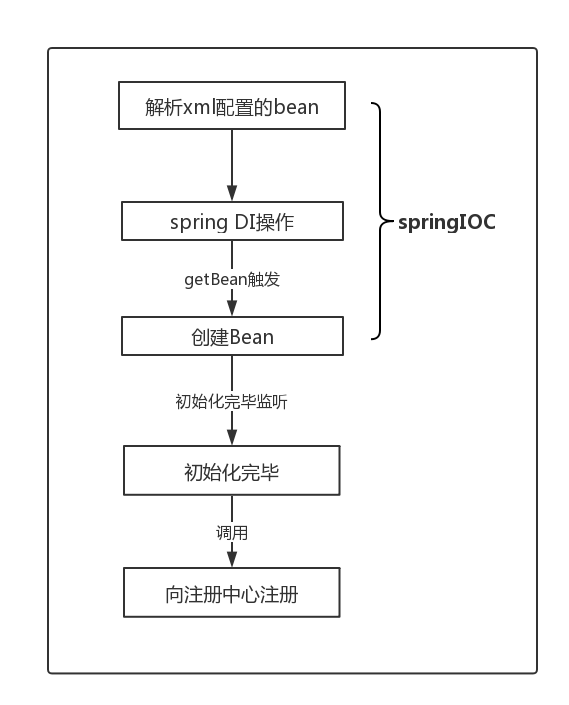
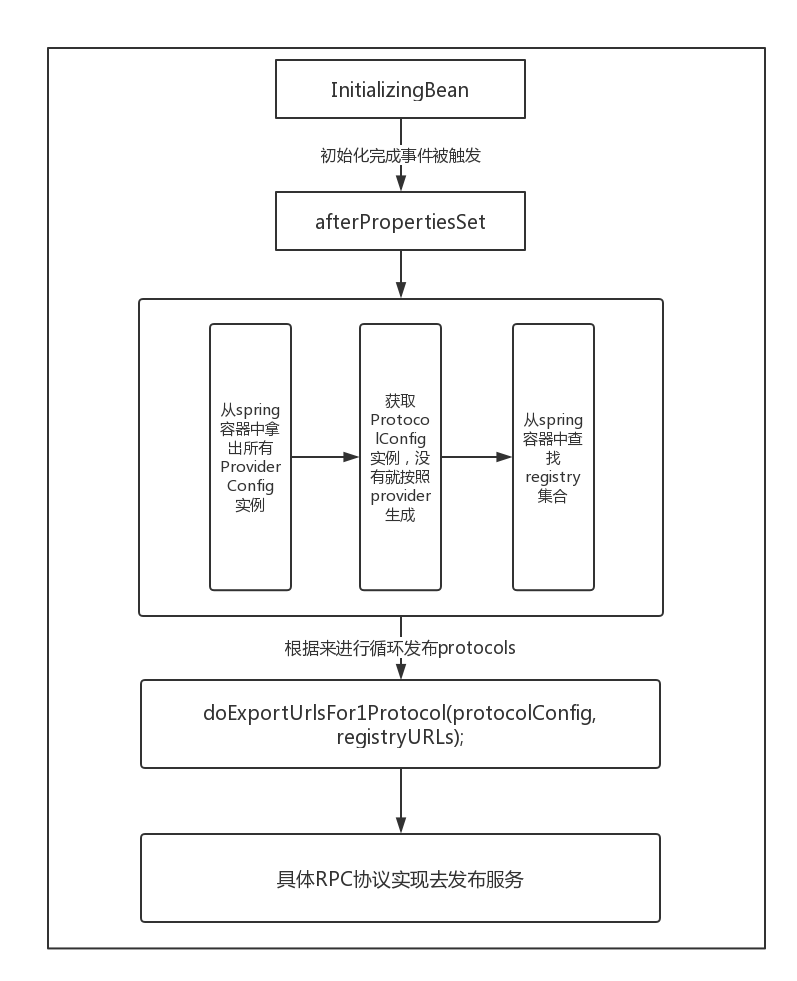

# Dubbo源码解析-bean的创建和服务暴露
> 项目中使用了dubbo有一段时间了，以前公司项目是ssm架构的单体应用，目前由于项目模块不断增长，开发迭代需要加快的前提下，参与了公司的项目改造，在dubbo和springCloud的权衡后还是选择了dubbo。

## dubbo bean加载过程        


  
## dubbo利用spring中schema扩展
1. 编写schema扩展文件(xsd文件)
2. 在classpath路劲下新建spring.schemas文件,将步骤1的xsd文件配置进该文件
    ```http\://code.alibabatech.com/schema/dubbo/dubbo.xsd=META-INF/dubbo.xsd```
3. 解析xml元素需要去实现spring的BeanDefinitionParser接口，解析xml元素并构造成BeanDefinition。
4. 继承NamespaceHandlerSupport,创建init方法,init方法需要去注册步骤三的解析器。
    ```java
    public void init() {
                 //注册各种类型的解析器
                 registerBeanDefinitionParser("application", new DubboBeanDefinitionParser(ApplicationConfig.class, true));
                 registerBeanDefinitionParser("module", new DubboBeanDefinitionParser(ModuleConfig.class, true));
                 registerBeanDefinitionParser("registry", new DubboBeanDefinitionParser(RegistryConfig.class, true));
                 registerBeanDefinitionParser("monitor", new DubboBeanDefinitionParser(MonitorConfig.class, true));
                 registerBeanDefinitionParser("provider", new DubboBeanDefinitionParser(ProviderConfig.class, true));
                 registerBeanDefinitionParser("consumer", new DubboBeanDefinitionParser(ConsumerConfig.class, true));
                 registerBeanDefinitionParser("protocol", new DubboBeanDefinitionParser(ProtocolConfig.class, true));
                 registerBeanDefinitionParser("service", new DubboBeanDefinitionParser(ServiceBean.class, true));
                 registerBeanDefinitionParser("reference", new DubboBeanDefinitionParser(ReferenceBean.class, false));
                 registerBeanDefinitionParser("annotation", new DubboBeanDefinitionParser(AnnotationBean.class, true));
             }
    ```
## dubbo发布服务
>### ServiceBean
* 发布前准备
```java
public void afterPropertiesSet() throws Exception {
        //开始是getProvider()为控制，这里先判断顶级提供者ProviderConfigMap
        if (getProvider() == null) {
            //拿到ProviderConfig的Map,spring可以有多个实例，看看dubbo怎么处理的
            Map<String, ProviderConfig> providerConfigMap = applicationContext == null ? null : BeanFactoryUtils.beansOfTypeIncludingAncestors(applicationContext, ProviderConfig.class, false, false);
            //看这里
            if (providerConfigMap != null && providerConfigMap.size() > 0) {
                //这里获取协议Bean ProtocolConfig配置提供者的RPC协议
                Map<String, ProtocolConfig> protocolConfigMap = applicationContext == null ? null : BeanFactoryUtils.beansOfTypeIncludingAncestors(applicationContext, ProtocolConfig.class, false, false);
                //协议ProtocolConfig不存在 并且有多个dubbo:provider
                if ((protocolConfigMap == null || protocolConfigMap.size() == 0)
                        && providerConfigMap.size() > 1) { // 兼容旧版本
                    List<ProviderConfig> providerConfigs = new ArrayList<ProviderConfig>();
                    //这里又判断了ProviderConfig是否设置default
                    //如果设置 dubbo:provider的情况下，设置了dubbo:protocol
                    for (ProviderConfig config : providerConfigMap.values()) {
                        if (config.isDefault() != null && config.isDefault().booleanValue()) {
                            providerConfigs.add(config);
                        }
                    }
                    if (providerConfigs.size() > 0) {
                        setProviders(providerConfigs);
                    }

                } else {
                    //这里就规定了 dubbo在配置了多个dubbo:provider的时候，且指定了dubbo:protocol的时候，必须指定一个default，否则抛出异常
                    ProviderConfig providerConfig = null;
                    for (ProviderConfig config : providerConfigMap.values()) {
                        if (config.isDefault() == null || config.isDefault().booleanValue()) {
                            if (providerConfig != null) {
                                throw new IllegalStateException("Duplicate provider configs: " + providerConfig + " and " + config);
                            }
                            providerConfig = config;
                        }
                    }
                    if (providerConfig != null) {
                        setProvider(providerConfig);
                    }
                }
            }
        }
       
        //这里在从spring容器中获取registry
        if ((getRegistries() == null || getRegistries().size() == 0)
                && (getProvider() == null || getProvider().getRegistries() == null || getProvider().getRegistries().size() == 0)
                && (getApplication() == null || getApplication().getRegistries() == null || getApplication().getRegistries().size() == 0)) {
            Map<String, RegistryConfig> registryConfigMap = applicationContext == null ? null : BeanFactoryUtils.beansOfTypeIncludingAncestors(applicationContext, RegistryConfig.class, false, false);
            if (registryConfigMap != null && registryConfigMap.size() > 0) {
                List<RegistryConfig> registryConfigs = new ArrayList<RegistryConfig>();
                for (RegistryConfig config : registryConfigMap.values()) {
                    if (config.isDefault() == null || config.isDefault().booleanValue()) {
                        registryConfigs.add(config);
                    }
                }
                if (registryConfigs != null && registryConfigs.size() > 0) {
                    super.setRegistries(registryConfigs);
                }
            }
        }
        ......
        //发布
        if (!isDelay()) {
            export();
        }
    }
```
* 发布
```java
public synchronized void export() {
    //各种检查
        if (provider != null) {
            if (export == null) {
                export = provider.getExport();
            }
            if (delay == null) {
                delay = provider.getDelay();
            }
        }
        if (export != null && !export) {
            return;
        }
    //这里又延迟发布的过程
        if (delay != null && delay > 0) {
            //延迟发布线程池去做
            delayExportExecutor.schedule(new Runnable() {
                public void run() {
                    doExport();
                }
            }, delay, TimeUnit.MILLISECONDS);
        } else {
        //直接发布
            doExport();
        }
    }
    
    //最后会调用该方法，dubbo是URL作为消息传递的，发布的都是url
    doExportUrls
    //该方法后面都是实际发布协议去做发布了，此处不写了，写不下去了，源码太长了，歇一下
```
> 注册流程


## 说一说
> ServiceBean实现了InitializingBean，spring会在bean初始化完毕后，调用afterPropertiesSet方法，该时机就是dubbo向远程注册中心注册的时机。
> 在这里简单的分析了发布前的过程，发布过程就不在这里讲，后续会继续写相关内容。
> 还有要说一点，上面说到的bean的定义过程也不需要关注，重要的是流程，bean的创建是托管至spring了。
